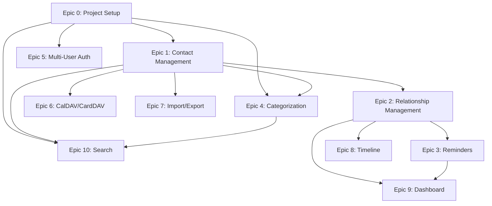

# Epics Overview

Welcome to the epic planning documents for Personal CRM! Each epic represents a major feature area that we've broken down into bite-sized, manageable phases.

## Epic List

| Epic | Title | Phase | Priority | Status |
|------|-------|-------|----------|--------|
| [Epic 0](epic-00-project-setup.md) | Project Setup & Infrastructure | Pre-MVP (Phase 0) | Critical | Planned |
| [Epic 1](epic-01-contact-management.md) | Contact Management | MVP (Phase 1) | High | Planned |
| [Epic 2](epic-02-relationship-management.md) | Relationship Management | Phase 2 | High | Planned |
| [Epic 3](epic-03-reminder-system.md) | Reminder System | Phase 2 | High | Planned |
| [Epic 4](epic-04-categorization-organization.md) | Categorization & Organization | MVP (Phase 1) | High | Planned |
| [Epic 5](epic-05-multi-user-management.md) | Multi-User Management | Phase 1 (auth), Phase 2 (full) | High/Medium | Planned |
| [Epic 6](epic-06-caldav-carddav-interface.md) | CalDAV/CardDAV Interface | Phase 3 | Medium | Planned |
| [Epic 7](epic-07-import-export.md) | Import/Export | Phase 3 | Medium | Planned |
| [Epic 8](epic-08-activity-timeline.md) | Activity Timeline | Phase 2 | Medium | Planned |
| [Epic 9](epic-09-dashboard-insights.md) | Dashboard & Insights | Phase 2 (basic), Phase 3 (extended) | Medium | Planned |
| [Epic 10](epic-10-search-functionality.md) | Search Functionality | Phase 1 (basic), Phase 2 (advanced) | High/Medium | Planned |

## Implementation Phases

### Phase 0: Project Setup
**Goal:** Get our development foundation rock-solid

**Epics:**
- Epic 0: Project Setup & Infrastructure

**What we're building:**
- A smooth development environment that just works
- CI/CD pipeline so we can ship with confidence
- Database setup with migrations
- Testing framework (because bugs are no fun)
- Docker configuration for easy deployment
- Clear documentation

---

### Phase 1: MVP (Minimum Viable Product)
**Goal:** Build something useful people can actually start using

**Epics:**
- Epic 1: Contact Management (the complete package)
- Epic 4: Categorization & Organization (groups & tags)
- Epic 5: Multi-User Management (authentication to get started)
- Epic 10: Search Functionality (find what you need)

**What you'll be able to do:**
- Create, edit, and manage your contacts
- Organize contacts into groups and tag them
- Search to find anyone quickly
- Log in securely (single-user for now)
- Use it on any device (responsive design!)

---

### Phase 2: Core Functionality
**Goal:** Add the features that make staying in touch easier

**Epics:**
- Epic 2: Relationship Management (track your interactions)
- Epic 3: Reminder System (never forget to reach out)
- Epic 5: Multi-User Management (full sharing capabilities)
- Epic 8: Activity Timeline (see your history)
- Epic 9: Dashboard & Insights (the big picture)
- Epic 10: Search Functionality (advanced filters)

**What you'll be able to do:**
- Keep a history of all your interactions
- Get reminded when it's time to reconnect
- Share contacts with family or housemates
- See a timeline of your relationship history
- Get insights into your social network
- Use powerful search filters and save them

---

### Phase 3: Integration & Polish
**Goal:** Make it work beautifully with everything else

**Epics:**
- Epic 6: CalDAV/CardDAV Interface (sync everywhere)
- Epic 7: Import/Export (your data, your way)
- Epic 9: Dashboard & Insights (even better analytics)

**What you'll be able to do:**
- Sync seamlessly with your phone and computer
- Import from Google Contacts, Apple Contacts, CSV files
- Export to vCard, CSV, JSON, or PDF
- Get deeper insights into your relationships
- Enjoy blazing-fast performance even with thousands of contacts

---

## Epic Dependencies

## How to Use This Directory

1. **Planning:** Check out the epic docs to understand what we're building and why
2. **Development:** Break down epics into bite-sized user stories and tasks
3. **Tracking:** Keep the epic status updated as we make progress
4. **Reference:** Use the technical details when making implementation decisions

## What's in Each Epic Document

Every epic includes:
- **Overview:** The big picture of what we're building
- **Goals:** What success looks like
- **Key Features:** The details that matter
- **User Stories:** Real scenarios from a user's perspective
- **Technical Considerations:** The nitty-gritty implementation details
- **Success Metrics:** How we'll know when we're done
- **Dependencies:** What needs to happen first
- **Out of Scope:** What we're explicitly not doing (and why)
- **Related Epics:** How everything connects

## What's Next

1. Polish and refine these epic documents
2. Prioritize the work within each phase
3. Break Phase 1 epics down into actionable user stories
4. Map out our sprint/iteration plans
5. Start building the MVP!

## Questions & Feedback

Got questions or ideas about these epics? We'd love to hear from you:
- Open an issue in the repo
- Bring it up in team meetings
- Update the epic docs as we make decisions

---

**Last Updated:** 2025-10-05
