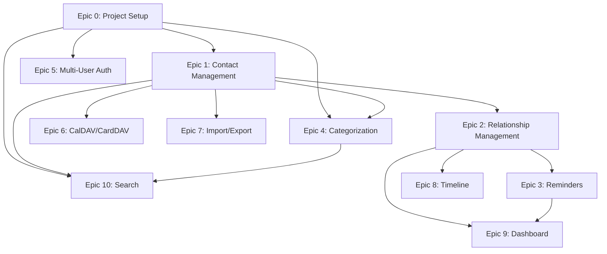

# Epics Overview

This directory contains detailed epic documents for the Personal CRM project. Each epic represents a major feature area broken down into manageable phases.

## Epic List

| Epic | Title | Phase | Priority | Status |
|------|-------|-------|----------|--------|
| [Epic 0](epic-00-project-setup.md) | Project Setup & Infrastructure | Pre-MVP (Phase 0) | Critical | Planned |
| [Epic 1](epic-01-contact-management.md) | Contact Management | MVP (Phase 1) | High | Planned |
| [Epic 2](epic-02-relationship-management.md) | Relationship Management | Phase 2 | High | Planned |
| [Epic 3](epic-03-reminder-system.md) | Reminder System | Phase 2 | High | Planned |
| [Epic 4](epic-04-categorization-organization.md) | Categorization & Organization | MVP (Phase 1) | High | Planned |
| [Epic 5](epic-05-multi-user-management.md) | Multi-User Management | Phase 1 (auth), Phase 2 (full) | High/Medium | Planned |
| [Epic 6](epic-06-caldav-carddav-interface.md) | CalDAV/CardDAV Interface | Phase 3 | Medium | Planned |
| [Epic 7](epic-07-import-export.md) | Import/Export | Phase 3 | Medium | Planned |
| [Epic 8](epic-08-activity-timeline.md) | Activity Timeline | Phase 2 | Medium | Planned |
| [Epic 9](epic-09-dashboard-insights.md) | Dashboard & Insights | Phase 2 (basic), Phase 3 (extended) | Medium | Planned |
| [Epic 10](epic-10-search-functionality.md) | Search Functionality | Phase 1 (basic), Phase 2 (advanced) | High/Medium | Planned |

## Implementation Phases

### Phase 0: Project Setup
**Goal:** Establish development infrastructure and tooling

**Epics:**
- Epic 0: Project Setup & Infrastructure

**Deliverables:**
- Complete development environment
- CI/CD pipeline
- Database setup with migrations
- Testing framework
- Docker configuration
- Documentation

---

### Phase 1: MVP (Minimum Viable Product)
**Goal:** Create a functional contact management system with basic features

**Epics:**
- Epic 1: Contact Management (complete)
- Epic 4: Categorization & Organization (groups & tags)
- Epic 5: Multi-User Management (authentication only, single-user)
- Epic 10: Search Functionality (basic search)

**Deliverables:**
- Users can create, read, update, delete contacts
- Contacts can be organized into groups and tagged
- Basic search functionality
- Single-user authentication
- Responsive web interface

---

### Phase 2: Core Functionality
**Goal:** Add relationship tracking and proactive contact maintenance

**Epics:**
- Epic 2: Relationship Management (interaction logging)
- Epic 3: Reminder System (automated reminders)
- Epic 5: Multi-User Management (full workspace/sharing features)
- Epic 8: Activity Timeline (view interaction history)
- Epic 9: Dashboard & Insights (basic widgets)
- Epic 10: Search Functionality (advanced filters)

**Deliverables:**
- Log and track interactions with contacts
- Automated reminders for contact maintenance
- Multi-user workspaces and sharing
- Timeline view of all activities
- Dashboard with key metrics
- Advanced search with saved filters

---

### Phase 3: Integration & Polish
**Goal:** Enable external integrations and data portability

**Epics:**
- Epic 6: CalDAV/CardDAV Interface (standards-compliant sync)
- Epic 7: Import/Export (data portability)
- Epic 9: Dashboard & Insights (extended analytics)

**Deliverables:**
- Sync with smartphones and desktop apps via CalDAV/CardDAV
- Import from Google Contacts, Apple Contacts, CSV
- Export to vCard, CSV, JSON, PDF
- Enhanced dashboard analytics and insights
- Performance optimization for large datasets

---

## Epic Dependencies

## How to Use This Directory

1. **For Planning:** Review epic documents to understand scope and requirements
2. **For Development:** Break down epics into user stories and tasks
3. **For Tracking:** Update epic status as work progresses
4. **For Reference:** Use technical details for implementation decisions

## Epic Document Structure

Each epic document includes:
- **Overview:** High-level description
- **Goals:** What we want to achieve
- **Key Features:** Detailed feature breakdown
- **User Stories:** User-centered requirements
- **Technical Considerations:** Implementation details
- **Success Metrics:** How we measure completion
- **Dependencies:** What's needed before starting
- **Out of Scope:** What we explicitly won't do
- **Related Epics:** How this connects to other work

## Next Steps

1. Review and refine epic documents
2. Prioritize epics within each phase
3. Break down Phase 1 epics into user stories
4. Create sprint/iteration plans
5. Begin implementation of MVP

## Questions & Feedback

For questions or suggestions about these epics, please:
- Open an issue in the project repository
- Discuss in team meetings
- Update epic documents as decisions are made

---

**Last Updated:** 2025-10-05
