# Epics Overview

Welcome to the epic planning documents for Freundebuch! Each epic represents a major feature area that we've broken down into bite-sized, manageable phases.

## Epic List

| Epic | Title | Phase | Priority | Status |
|------|-------|-------|----------|--------|
| [Epic 0](epic-00-done-project-setup.md) | Project Setup & Infrastructure | Pre-MVP (Phase 0) | Critical | **Done** |
| [Epic 1](epic-01-done-friend-management.md) | Friend Management | MVP (Phase 1) | High | **Done** |
| [Epic 2](epic-02-planned-relationship-management.md) | Relationship Management | Phase 2 | High | Planned |
| [Epic 3](epic-03-planned-reminder-system.md) | Reminder System | Phase 2 | High | Planned |
| [Epic 4](epic-04-planned-categorization-organization.md) | Categorization & Organization | MVP (Phase 1) | High | Planned |
| [Epic 5](epic-05-done-multi-user-management.md) | Multi-User Management (Auth) | MVP (Phase 1) | High | **Done** |
| [Epic 6](epic-06-partial-caldav-carddav-interface.md) | CalDAV/CardDAV Interface | Phase 3 | Medium | **Partial** (6A Done) |
| [Epic 7](epic-07-planned-import-export.md) | Import/Export | Phase 3 | Medium | Planned |
| [Epic 8](epic-08-planned-activity-timeline.md) | Activity Timeline | Phase 2 | Medium | Planned |
| [Epic 9](epic-09-planned-dashboard-insights.md) | Dashboard & Insights | Phase 2 (basic), Phase 3 (extended) | Medium | Planned |
| [Epic 10](epic-10-done-search-functionality.md) | Search Functionality (Basic) | MVP (Phase 1) | High | **Done** |
| [Epic 11](epic-11-planned-custom-fields.md) | Custom Fields | Phase 2 | Low | Planned |
| [Epic 12](epic-12-planned-collectives.md) | Collectives | Phase 2 | Medium | Planned |
| [Epic 13](epic-13-future-self-service-pages.md) | Self-Service Friend Pages | Phase 4 | Low | Future |
| [Epic 14](epic-14-done-subresource-inline-editing.md) | Subresource Inline Editing | Enhancement | High | **Done** |
| [Epic 15](epic-15-planned-friend-notes.md) | Friend Notes | MVP (Phase 1) | High | Planned |
| [Epic 16](epic-16-planned-multi-user-workspaces.md) | Multi-User Workspaces | Phase 2 | Medium | Planned |
| [Epic 17](epic-17-planned-advanced-search.md) | Advanced Search | Phase 2 | Medium | Planned |
| [Epic 18](epic-18-planned-better-auth-migration.md) | Better Auth Migration | Phase 1.5 | High | Planned |

## Implementation Phases

### Phase 0: Project Setup - COMPLETE
**Goal:** Get our development foundation rock-solid

**Epics:**
- Epic 0: Project Setup & Infrastructure - **Done**

**What we built:**
- A smooth development environment that just works
- CI/CD pipeline so we can ship with confidence
- Database setup with migrations
- Testing framework (because bugs are no fun)
- Docker configuration for easy deployment
- Clear documentation

---

### Phase 1: MVP (Minimum Viable Product) - IN PROGRESS
**Goal:** Build something useful people can actually start using

**Epics:**
- Epic 1: Friend Management - **Done** (1A, 1B, 1D complete)
- Epic 4: Categorization & Organization (groups & tags) - Planned
- Epic 5: Multi-User Management (authentication) - **Done**
- Epic 10: Search Functionality (basic) - **Done**
- Epic 14: Subresource Inline Editing - **Done**
- Epic 15: Friend Notes - Planned (extracted from Epic 1C)

**What you can do now:**
- Create, edit, and manage your contacts
- Add phones, emails, addresses, URLs, dates, social profiles inline
- Define relationships between contacts
- Search to find anyone quickly
- Log in securely (single-user)
- Use it on any device (responsive design!)

**Still to come:**
- Organize contacts into groups and tag them (Epic 4)
- Contact notes (Epic 15)

---

### Phase 1.5: Post-MVP Enhancement
**Goal:** Improve the foundation before expanding features

**Epics:**
- Epic 18: Better Auth Migration - Planned

**What we'll do:**
- Replace custom auth with Better Auth library
- Reduce maintenance burden
- Enable future auth features (2FA, social login, passkeys)

---

### Phase 2: Core Functionality
**Goal:** Add the features that make staying in touch easier

**Epics:**
- Epic 2: Relationship Management (track your interactions) - Planned
- Epic 3: Reminder System (never forget to reach out) - Planned
- Epic 8: Activity Timeline (see your history) - Planned
- Epic 9: Dashboard & Insights (the big picture) - Planned
- Epic 11: Custom Fields (make it truly yours) - Planned
- Epic 12: Collectives (families, companies, and groups with auto-relationships) - Planned
- Epic 16: Multi-User Workspaces (sharing capabilities) - Planned (extracted from Epic 5)
- Epic 17: Advanced Search (filters, fuzzy search, saved searches) - Planned (extracted from Epic 10)

**What you'll be able to do:**
- Keep a history of all your interactions
- Get reminded when it's time to reconnect
- Share contacts with family or housemates
- See a timeline of your relationship history
- Get insights into your social network
- Use powerful search filters and save them
- Add your own custom fields to contacts
- Group contacts into families, companies, or clubs with automatic relationship creation

---

### Phase 3: Integration & Polish
**Goal:** Make it work beautifully with everything else

**Epics:**
- Epic 6: CalDAV/CardDAV Interface (sync everywhere)
- Epic 7: Import/Export (your data, your way)
- Epic 9: Dashboard & Insights (even better analytics)

**What you'll be able to do:**
- Sync seamlessly with your phone and computer
- Import from Google Contacts, Apple Contacts, CSV files
- Export to vCard, CSV, JSON, or PDF
- Get deeper insights into your relationships
- Enjoy blazing-fast performance even with thousands of contacts

---

### Phase 4: The Full Circle
**Goal:** Bring back the original Freundebuch experience

**Epics:**
- Epic 13: Self-Service Friend Pages

**What you'll be able to do:**
- Send a link to friends so they can fill out their own pages
- Customize what information you want them to share
- Get notified when friends complete their pages
- Let friends update their info over time
- Just like passing around a Freundebuch, but digital!

---

## Epic Dependencies

```mermaid
graph TD
    E0[Epic 0: Project Setup ✅] --> E1[Epic 1: Friend Management ✅]
    E0 --> E4[Epic 4: Categorization]
    E0 --> E5[Epic 5: Multi-User Auth ✅]
    E0 --> E10[Epic 10: Search ✅]
    E1 --> E2[Epic 2: Relationship Management]
    E1 --> E4
    E1 --> E10
    E1 --> E11[Epic 11: Custom Fields]
    E1 --> E12[Epic 12: Collectives]
    E1 --> E15[Epic 15: Friend Notes]
    E2 --> E3[Epic 3: Reminders]
    E2 --> E8[Epic 8: Timeline]
    E2 --> E9[Epic 9: Dashboard]
    E3 --> E9
    E1 --> E6[Epic 6: CalDAV/CardDAV 🔶]
    E1 --> E7[Epic 7: Import/Export]
    E4 --> E10
    E4 --> E17[Epic 17: Advanced Search]
    E10 --> E17
    E1 --> E13[Epic 13: Self-Service Pages]
    E5 --> E13
    E5 --> E16[Epic 16: Multi-User Workspaces]
    E5 --> E18[Epic 18: Better Auth Migration]
    E18 --> E16
    E1 --> E14[Epic 14: Inline Editing ✅]
```

## How to Use This Directory

1. **Planning:** Check out the epic docs to understand what we're building and why
2. **Development:** Break down epics into bite-sized user stories and tasks
3. **Tracking:** Keep the epic status updated as we make progress
4. **Reference:** Use the technical details when making implementation decisions

## What's in Each Epic Document

Every epic includes:
- **Overview:** The big picture of what we're building
- **Goals:** What success looks like
- **Key Features:** The details that matter
- **User Stories:** Real scenarios from a user's perspective
- **Technical Considerations:** The nitty-gritty implementation details
- **Success Metrics:** How we'll know when we're done
- **Dependencies:** What needs to happen first
- **Out of Scope:** What we're explicitly not doing (and why)
- **Related Epics:** How everything connects

## What's Next

1. Polish and refine these epic documents
2. Prioritize the work within each phase
3. Break Phase 1 epics down into actionable user stories
4. Map out our sprint/iteration plans
5. Start building the MVP!

## Questions & Feedback

Got questions or ideas about these epics? We'd love to hear from you:
- Open an issue in the repo
- Bring it up in team meetings
- Update the epic docs as we make decisions

---

**Last Updated:** 2026-01-10
